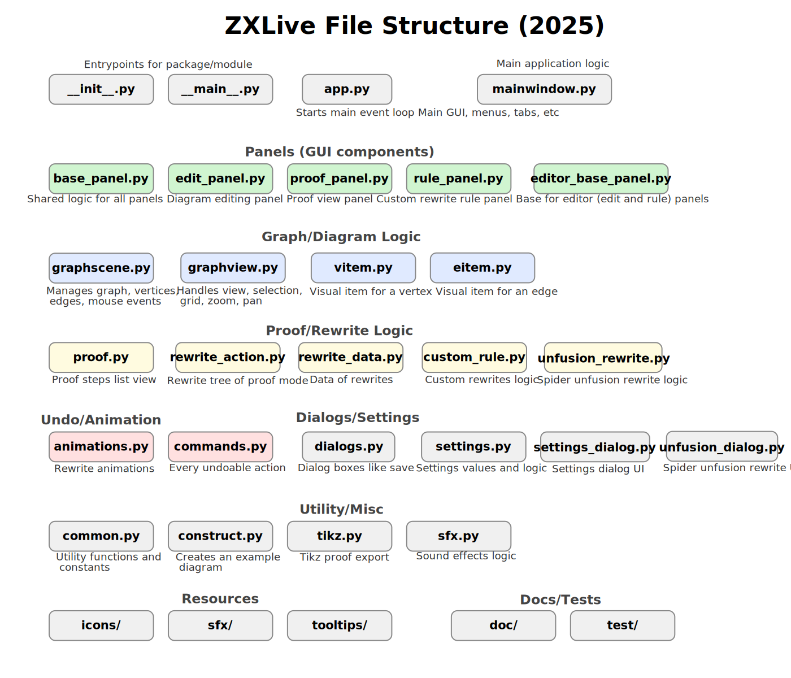

# Guidelines for contributing to ZXLive

Thanks for wanting to contribute to ZXLive! Here are a couple of things you might want to keep in mind in order to make the process as smooth as possible:

- Avoid re-implementing stuff. If it is PyZX, use it! If it is in Qt, use it! 
- If you want to contribute something not directly related to GUI components, consider whether it would be better placed in PyZX (things like logic for rewriting graphs belongs there).
- When doing any kind of GUI stuff, check whether the thing you want to implement has an implementation in Qt you can use.
- We use the Model/View distinction. Try to separate out the logic of a Thing  (Model) and the way it is drawn (View) as much as possible. 
- We aim to get to 100% type annotation coverage and to have no mypy complaints. If you contribute, consider including types as much as possible (although this is not a requirement).
- If you are implementing a GUI feature that you think the user might want to use with any kind of regularity, consider adding an appropriate hotkey for it.

Overview of the different source files of ZXLive:

