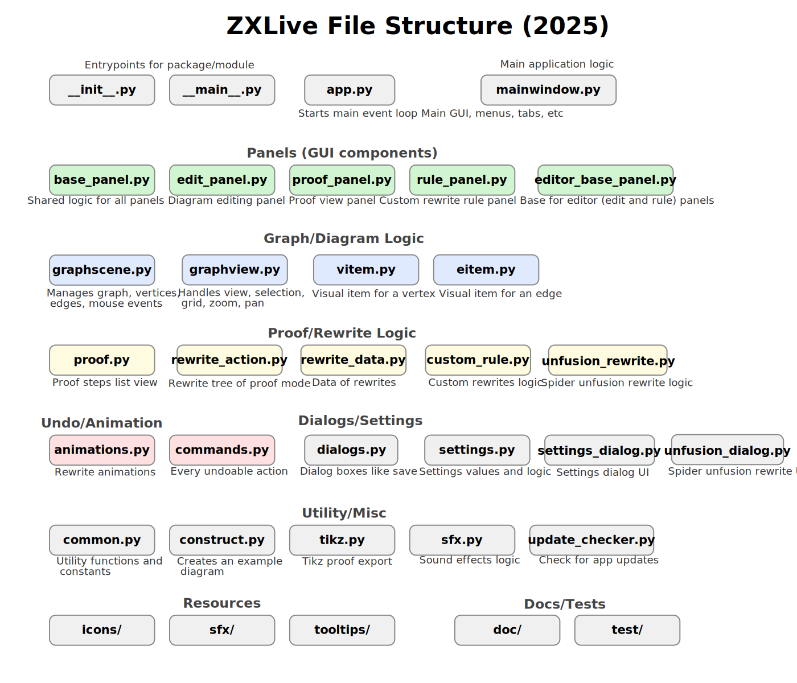

The [ZX-calculus](http://zxcalculus.com) gives us a handy way to represent and work with quantum computations. ZXLive is an interactive tool for working with ZX. Draw graphs or load circuits and apply ZX rules. Intended for experimenting, building proofs, helping to write papers, showing off, or simply learning about ZX and quantum computing. It is powered by the [pyzx](https://github.com/zxcalc/pyzx) open source library under the hood. The documentation is available at https://zxlive.readthedocs.io/

This project is in a pretty early stage, with lots more to come. Have a look at the [Issue Tracker](https://github.com/zxcalc/zxlive/issues) to see what's in the pipeline.

## Instructions

To install from source, you need Python >= 3.9 and pip. If you have those, just run:

    git clone https://github.com/zxcalc/zxlive.git
    cd zxlive
    pip install .

Then, you can run ZXLive by typing `zxlive`.

Note that ZXLive requires the most recent development version of PyZX. If you already have a version of PyZX installed, first uninstall it with `pip uninstall pyzx`, and then run `pip install .` in the ZXLive folder (or manually install the latest PyZX version using `pip install @git+https://github.com/zxcalc/pyzx.git`).

# Testing

To ensure the quality and correctness of this project, several testing and linting tools are utilized.
Below are the steps to run the tests and checks:

## 1. Static Type Checks with mypy

You can run mypy to perform static type checking:
 
    mypy zxlive

## 2. Unit Tests with pytest

Execute the test suite using pytest to ensure all tests pass:

    pytest

# Documentation

This project uses Sphinx to build a ReadTheDocs page. In addition, it uses the MyST preprocessor to allow us to write documentation in a Markdown-like format rather than Sphinx's native rich structured text format.

The documentation can be built with

    cd doc
    make html

# Overview of the files
