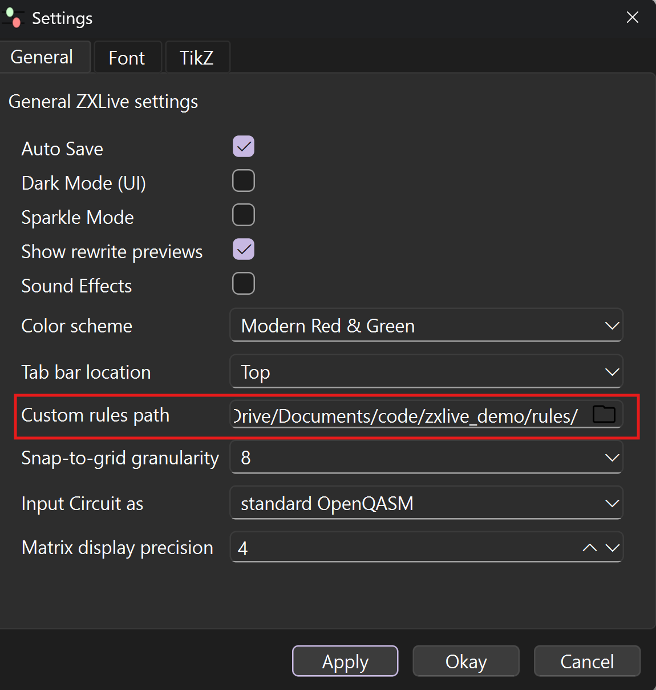
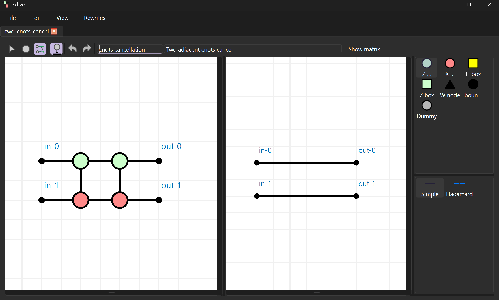
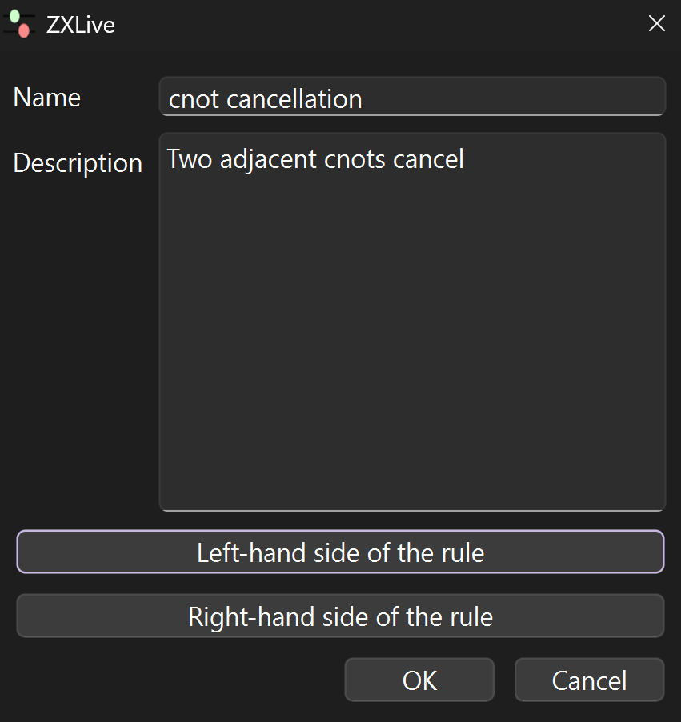
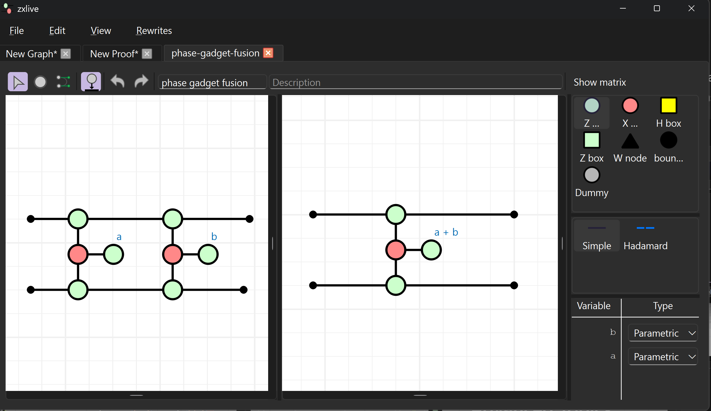

# Adding Custom Rewrite Rules in ZXLive

ZXLive comes with a rich set of built-in rewrite rules for the ZX-calculus (and ZH/ZW), and it also lets you create and add your own. This page explains how to create custom rules.


## Overview

Rewrites in ZXLive are transformations that can be applied to parts of a ZX-diagram. A rewrite consists of a Left-Hand Side (LHS) diagram pattern and a Right-Hand Side (RHS) replacement pattern. When the LHS pattern is found in a diagram, it can be replaced with the RHS pattern. Each custom rule is a `.zxr` file. There are three ways to create new rewrites:

1. **Use the Rule Editor (GUI).** - Using ZXLive's built-in rule editor
2. **Import from existing diagram files.** - Select ZX graph files for LHS and RHS of the rule.
3. **Save a finished proof as a rule.** - Convert a completed proof into a reusable rule.

:::{important}
**Where ZXLive looks for rules**\
ZXLive loads `.zxr` files from your **Custom rules path** (configure in `Edit > Preferences`).


:::

:::{tip}
**Refresh without restarting**\
In proof mode, right‑click the **Rewrites** panel and choose **Refresh rules** to re‑scan your rules folder.
:::

## Creating Custom Rules

### 1. Create via GUI (Rule Editor)

1. **Open**: Go to `Rewrites > New rewrite` in the menu bar
2. **Design LHS**: Build the pattern to match in the left pane.
3. **Design RHS**: Build the replacement pattern in the right pane.
4. **Add metadata**: Give the rule a clear **Name** and **Description**.
5. **Save**: `File > Save` → choose a location under your Custom Rules Path to create a `.zxr`.



---

### 2. Create from existing files

1. **Open**: Go to `Rewrites > New rewrite from file`
2. **Select files**: Pick the LHS and RHS diagram files.
3. **Add metadata and save**: Provide a name/description and save as `.zxr` under your rules folder.



---

### 3. Convert a completed proof into a rule

1. **Finish a proof**: In the proof mode, show the equivalence between two diagrams.
2. **Extract the rewrite**: `Rewrites > Save proof as a rewrite`
3. **Add metadata and save**: Provide a name/description and save as `.zxr` under your rules folder.

This creates a rule where:
- **LHS**: the initial diagram of the proof
- **RHS**: the final diagram of the proof

*Example: adjacent CNOT gates cancel.*


---

## Parametric rules

Instead of hard-coding specific phase values in your rewrite rules, you can use parameters to create more general and flexible transformations. This allows the same rule to apply to any valid instantiation of those parameters.

For example, the following phase gadget fusion rule uses parameters `a` and `b` that will transform to `a + b` when fused. This will apply to any phases, for instance when `a = π/2` and `b = π/4`, the result will be a phase of `3π/4`.



---

## Tips

- If your rule doesn't appear in the Rewrites panel, ensure that the **Custom rules path** is correctly set in preferences and that the `.zxr` files are located there. Use the **Refresh rules** option to reload.
- Consider organizing your custom rules into subfolders for better management. For example:
```
rules/
├── basic-simplifications/
│   ├── my-identity-removal.zxr
│   └── my-spider-fusion.zxr
├── quantum-circuits/
│   ├── cnots-cancellation.zxr
│   └── gate-teleportation.zxr
└── error-correction/
    ├── cat-state-prep.zxr
    └── surface-code-stabilizers.zxr
```
