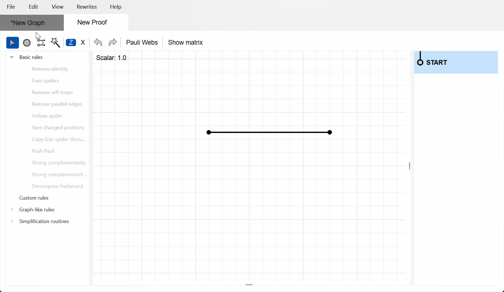
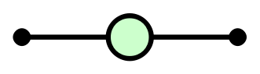
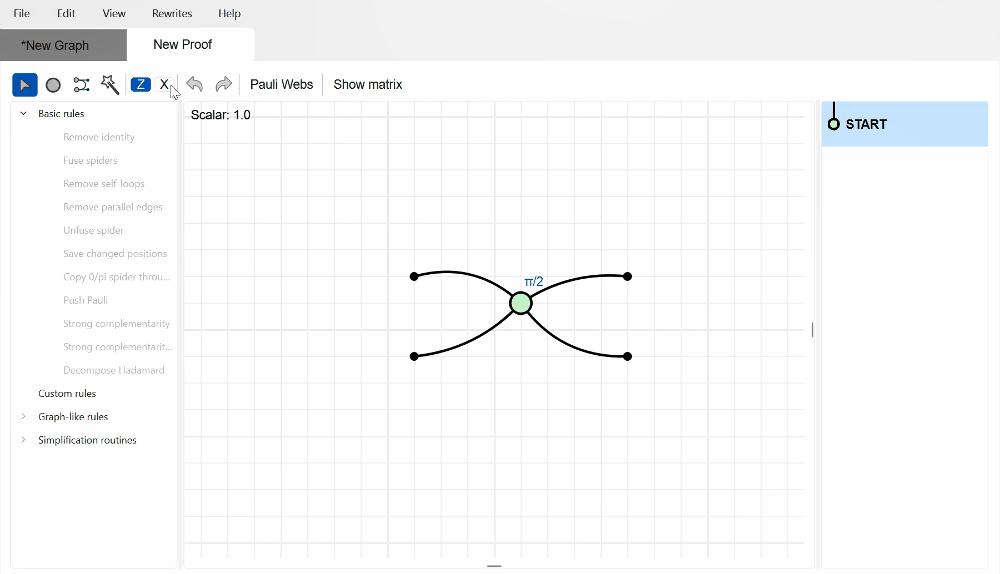
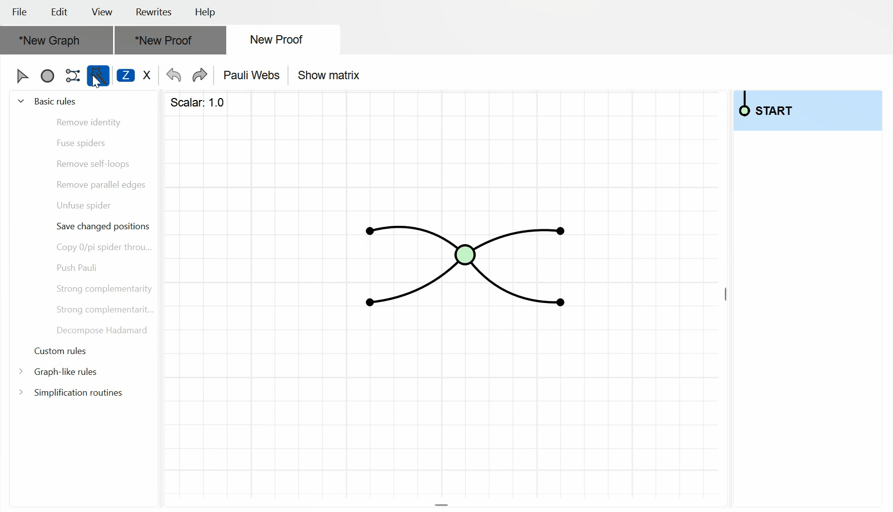
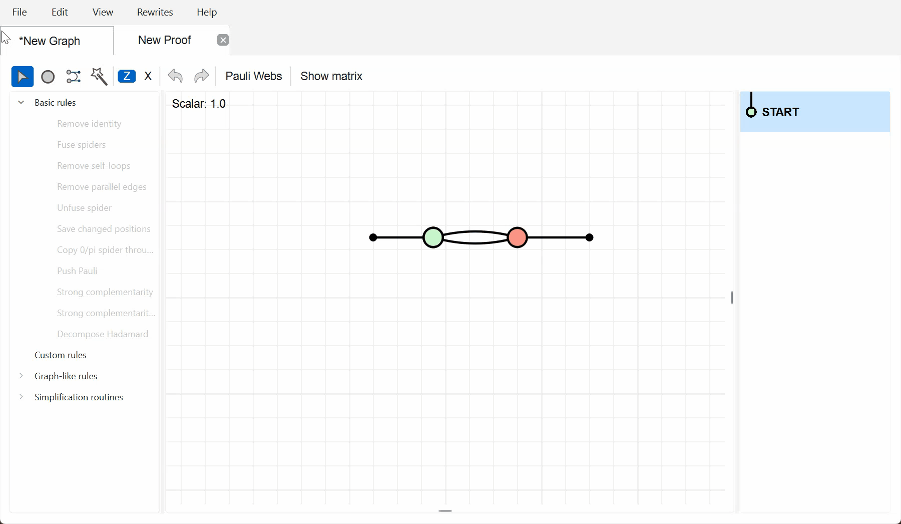
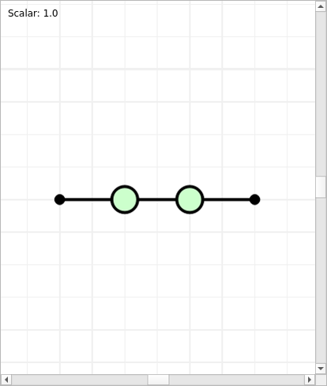
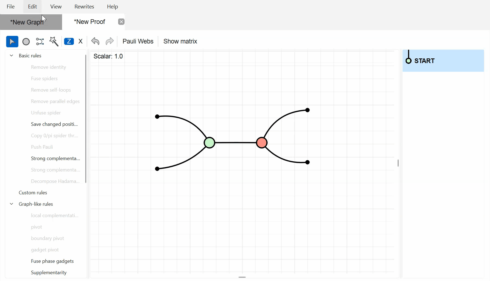
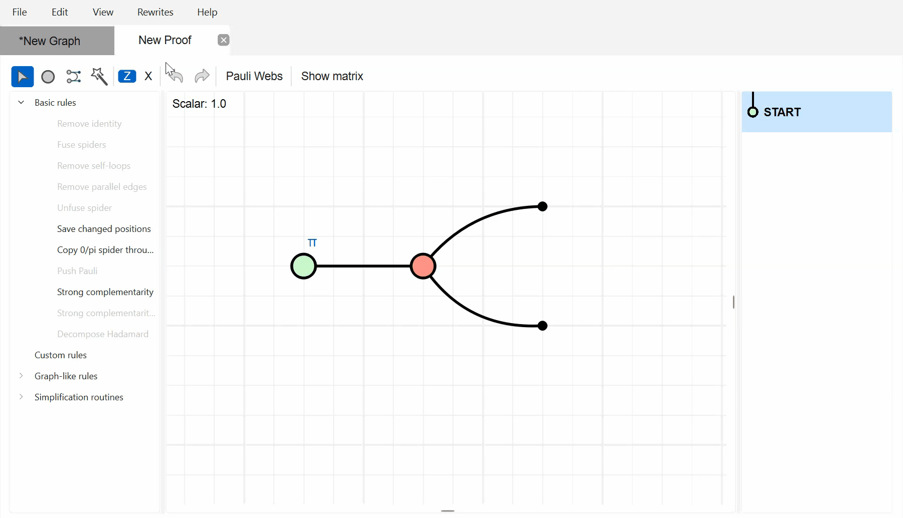

# Gestures and rewrites

This page is a reference for the interactive gestures available in **Proof mode**: the magic wand, and the drag-and-drop rewrites. For a guided introduction to proof mode, see [Getting started with ZXLive](gettingstarted.md).

:::{note}
All of these gestures are only available in Proof mode. Switch to it by clicking "Start Derivation" in the Editor window. Each gesture adds a step to the rewrite history panel and can be undone with `Ctrl-U`.
:::

## The magic wand

Activate the magic wand by clicking its toolbar button or pressing `w`, then draw a stroke across part of the diagram with the left mouse button. What happens depends on what the stroke passes over.

### Draw over a wire — add an identity spider

Drawing the wand across a plain wire inserts a new identity (phaseless) spider in the middle of that wire, splitting it in two. The color of the new spider (Z or X) is set by the spider-type toggle in the proof toolbar.

*Draw over a wire to insert an identity spider.*

### Draw over a 2-legged spider — remove identity

Drawing over a phaseless spider that has exactly two legs removes it, fusing the two wires back into one.

*Draw over a phaseless 2-legged spider to remove it.*

### Draw over a spider — unfuse

Drawing across any other spider unfuses it into two connected spiders. The stroke determines the split: edges on one side of the stroke move to the new spider, edges on the other side stay. The phase remains on the side the stroke favors.

*Draw across a spider to unfuse it, splitting its edges left and right.*

### Shift + draw over a spider — unfuse with a custom phase

Holding `Shift` while drawing across a spider unfuses it as above, but first prompts you for the phase to place on the split-off spider (in units of pi, or a complex value for a Z-box).

*Hold `Shift` and draw across a spider to unfuse with a chosen phase.*

:::{warning}
Hold `Shift` for the entire stroke. If you release it before lifting the mouse button, the wand falls back to a plain unfuse.
:::

### Draw over parallel edges — Hopf rule

Drawing across two or more parallel edges between complementary-colored spiders (a Z-like and an X spider, or a Hadamard edge between two Z-like spiders) applies the Hopf rule, removing the edges in pairs.

*Draw across parallel edges between complementary spiders to apply the Hopf rule.*

## Drag-and-drop rewrites

In select mode (`s`), some rewrites are triggered by dragging one spider onto another.

### Drag spiders of the same color together — fusion

Dragging a spider onto an adjacent spider of the same color fuses them into a single spider, adding their phases.

*Drag same-colored spiders together to fuse them.*

### Drag a Z spider onto an X spider — bialgebra

Dragging a Z spider onto a connected X spider (or vice versa) applies the bialgebra rule.

*Drag a Z spider onto a complementary X spider to apply bialgebra.*

:::{note}
ZXLive records this step as "Strong complementarity" in the rewrite history panel.
:::

### Drag a 0/π spider through its neighbor — pi copy

Dragging a spider with a phase of 0 or π through its neighbor copies it through, applying the copy (pi-copy) rule.

*Drag a 0/π spider through its neighbor to copy it through.*
