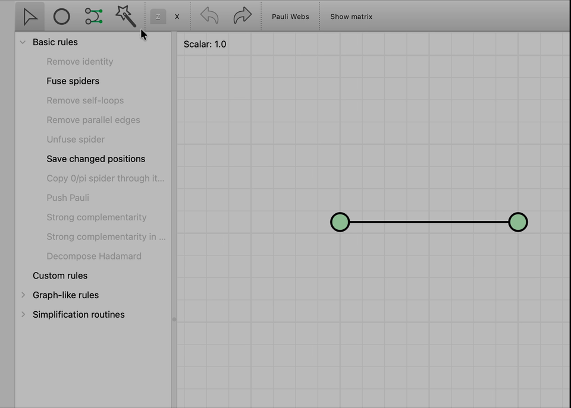

# Interactive Features in ZXLive

ZXLive provides a rich set of interactive tools for applying ZX-calculus rewrite rules directly
on diagrams. Many of these interactions are not immediately obvious — this page documents all
the key features you can use in **Proof mode**, with descriptions of how to trigger them.

> **Note:** All the features described here are available in **Proof mode** (after clicking
> "Start Derivation"). They do not apply in the Editor mode, where you freely add and remove
> nodes.

---

## The Magic Wand

The magic wand (shortcut: `w`) is the primary interaction tool in Proof mode. It lets you
apply several rules simply by drawing a stroke over part of the diagram.

To activate it, press `w` or click the wand icon in the toolbar.

*The Proof window's toolbar. 1. Select mode (s), 2. Magic wand (w), 3. Spider type selector
for wire splits, 4. Undo / Redo.*

---

## Adding Identity Spiders

When you draw the magic wand **across a plain wire** (an edge with no spider on it), ZXLive
inserts a new identity spider at that point on the wire.

The **type** of spider inserted (Z or X) is controlled by the spider-type selector in the
toolbar (item 3 in the toolbar image above).

**When to use this:** Adding an identity spider is useful when you need to split a wire before
applying a rule — for example, to introduce a spider that you can then fuse with a neighbour,
or to set up the bialgebra rule.

**How to do it:**

1. Press `w` to enter magic wand mode.
2. Select the desired spider type (Z or X) from the toolbar selector.
3. Click and drag across any plain wire in the diagram.

A new identity spider (phase = 0) will appear on that wire.

---

## Removing Identity Spiders

A spider with **exactly two legs and a phase of 0** is equal to the identity — it can be
removed without changing the meaning of the diagram.

There are two ways to remove an identity spider:

**Method 1 — Rule panel:**

1. Press `s` to enter select mode.
2. Click the identity spider to select it.
3. In the rule panel on the left, click **Basic rules → Remove identity**.

**Method 2 — Magic wand:**

1. Press `w` to enter magic wand mode.
2. Draw the wand directly over the identity spider.

ZXLive will remove the spider and reconnect the wire automatically.

---

## Spider Fusion

Two spiders of the **same colour** (both Z or both X) that are connected by a wire can be
**fused** into a single spider. The phases of the two spiders are added together.

This corresponds to the *spider fusion* rule of ZX-calculus:

> Two same-colour spiders sharing an edge merge into one, with the sum of their phases.

**How to do it:**

1. Press `s` to enter select mode.
2. Click and drag one spider on top of the other.

ZXLive will automatically detect that the two spiders are of the same colour and connected,
and will apply the fusion rule.

*Dragging adjacent same-colour spiders together to fuse them.*

---

## The Bialgebra Rule

The **bialgebra rule** applies when a Z spider and an X spider are connected. Dragging one
onto the other causes ZXLive to apply the bialgebra (or "Hopf") interaction, which expands
the connection into a complete bipartite graph of the two spiders' neighbours.

**How to do it:**

1. Press `s` to enter select mode.
2. Drag a Z spider onto a connected X spider (or vice versa).

ZXLive will recognise the complementary types and apply the bialgebra rule.

*Applying the bialgebra rule by dragging a Z spider onto an X spider.*

> **Tip:** The same drag-and-drop gesture applies both spider fusion (same colour) and the
> bialgebra rule (complementary colours). ZXLive automatically picks the correct rule based
> on the colours of the two spiders.

---

## The Hopf Rule

The **Hopf rule** (also called the *Hopf algebra rule*) states that when two complementary
spiders (one Z, one X) are connected by **two or more parallel wires**, those wires cancel
out and the spiders become disconnected.

ZXLive applies this rule **automatically** whenever it detects double (or higher multiplicity)
edges between complementary spiders — you do not need to trigger it manually. You may notice
it activating silently during a sequence of spider fusion steps.

> **Example:** After fusing two X spiders, the resulting spider may end up with two edges to
> a Z spider. ZXLive will automatically remove both edges, applying the Hopf rule without any
> additional user action.

---

## The Pi Copy Rule

The **pi copy rule** applies to spiders with a phase of π. It allows a π-phase spider to be
"copied" through a connected spider of the complementary colour, with the π phase propagating
to the neighbours.

**How to trigger it:**

1. Press `s` to enter select mode.
2. Select the π-phase spider.
3. In the rule panel on the left, look under **Basic rules** for the **Pi copy** option, and
   click it.

Alternatively, you can use the magic wand and draw over a π spider connected to a
complementary spider to apply the rule interactively.

> **When to use this:** The pi copy rule is particularly useful in simplifying Clifford
> circuits, where π and π/2 phases appear frequently.

---

## Summary Table

| Feature | How to trigger | Mode |
|---|---|---|
| Add identity spider | Magic wand (`w`) over a plain wire | Proof |
| Remove identity spider | Magic wand over identity spider, *or* select + rule panel | Proof |
| Spider fusion | Drag same-colour spider onto a connected same-colour spider | Proof |
| Bialgebra rule | Drag Z spider onto connected X spider (or vice versa) | Proof |
| Hopf rule | Applied automatically when double edges appear between complementary spiders | Proof |
| Pi copy rule | Select π spider + rule panel, *or* magic wand over π spider | Proof |

---

## See Also

- [Getting started with ZXLive](gettingstarted.md) — a full worked example (three CNOTs → SWAP)
  that uses several of these features together.
- [Adding Custom Rewrite Rules](adding-rewrites.md) — how to define and apply your own rules.
