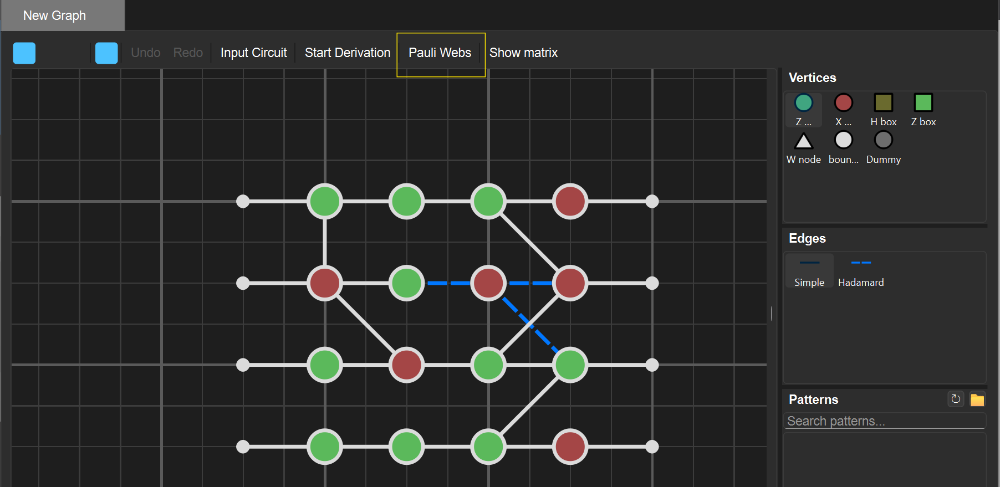
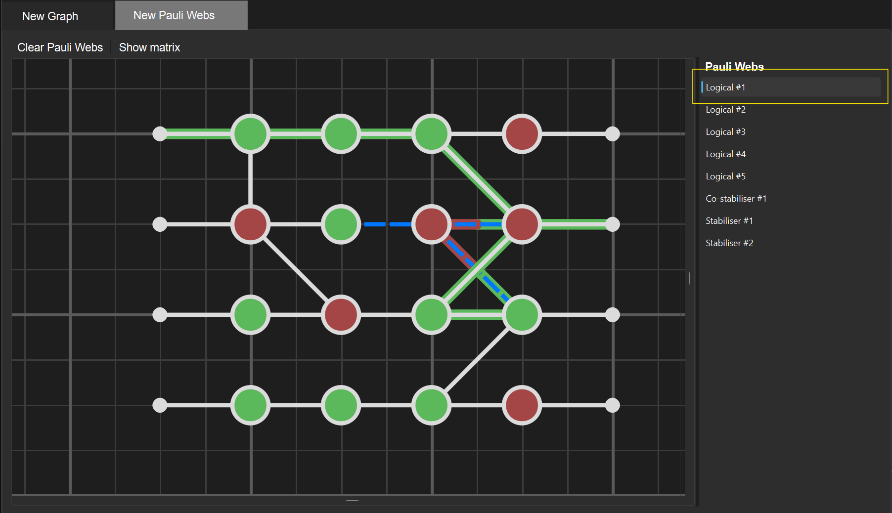
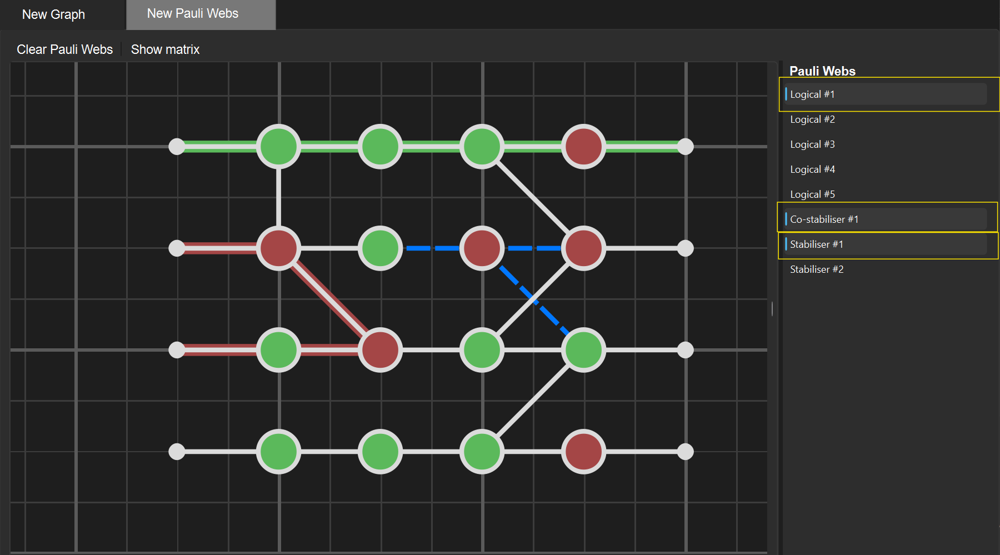
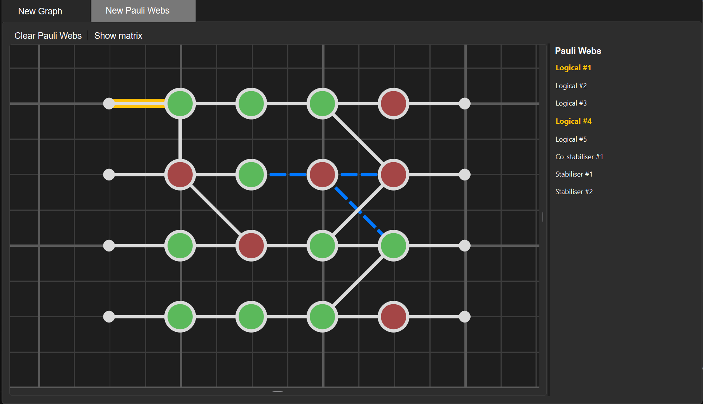
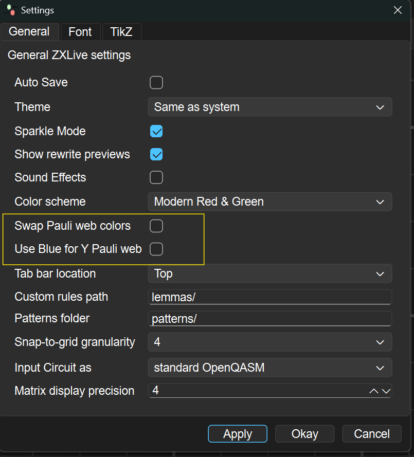

# Using the Pauli Web Panel in ZXLive

The Pauli Web panel in ZXLive provides tools for working with generating Pauli webs, visualizing their structure, and interacting with diagram edges. This page explains how to use the panel and its main functionality. The Pauli webs are computed by PyZX.

## Overview

The Pauli Web panel allows you to:

* Browse available Pauli webs
* See the **type** of each web (e.g. logical, stabilizer, etc.)
* Visualise one or multiple Pauli webs on your diagram
* Inspect which generating Pauli web an edge belongs to
* Configure visualization conventions in the settings

**Where to find the Pauli Web panel**
The Pauli Web panel can be accessed by clicking the Pauli Webs button in the toolbar.

---

## Selecting and Adding Pauli Webs

You can insert Pauli webs directly from the list shown on the right in the panel.

### Selecting a single Pauli web

1. Open the Pauli Web panel
2. Click on a Pauli web in the list
3. The selected web will be displayed in your diagram

---

### Selecting multiple Pauli webs

You can select multiple Pauli webs at once. ZXLive will automatically add them correctly and visualise it in the diagram.

1. Hold the multi‑select key (e.g. Ctrl / Cmd)
2. Click multiple Pauli webs in the list
3. Addition of all selected webs will be displayed

---

### Viewing Pauli web types

Pauli webs are categorized according to the types of edges they color. An edge is considered an _input edge_ if its leftmost vertex is a boundary vertex, and an _output edge_ if its rightmost vertex is a boundary vertex. The label of a Pauli web identifies whether it includes any input or output edges:

- **Logical** – includes at least one input and one output edge
- **Stabilizer** – includes no input edges and at least one output edge
- **Co-stabilizer** – includes at least one input edge and no output edges
- **Detecting region** – includes no input or output edges

In the case that ZXLive cannot determine input and output edges (for example, if a boundary vertex has multiple neighbors or a boundary edge is vertically oriented), a warning will be displayed.

---

## Inspecting Generating Pauli Webs from Diagram Edges

You can inspect which generating Pauli web an edge belongs to directly from the diagram.

### Highlighting a generating Pauli web

1. Double‑click an edge in the diagram
2. ZXLive highlights the generating Pauli web associated with that edge

---

### Removing highlighting

To remove highlighting:

1. Double‑click anywhere else in the diagram (not on an edge)
2. The highlight will be cleared

---

## Visualization and Coloring Settings

You can customize how Pauli edges are colored via the settings.

### Available options

You can configure:

* **Swap Pauli web colors** – swap the red and green edge meanings depending on your convention
* **Use blue for Y Pauli web** – display Y edges using blue coloring instead of red and green

### Changing the settings

1. Open `Edit > Preferences`
2. Select your preferred coloring convention
3. Apply or save the settings

---

## Limitations

* The diagram must be a Clifford diagram and thus cannot contain spiders with non-Clifford phases
* The diagram must be a simple graph (i.e., there can be no more than one edge between two vertices)
* All Hadamard boxes must have exactly two neighbors
