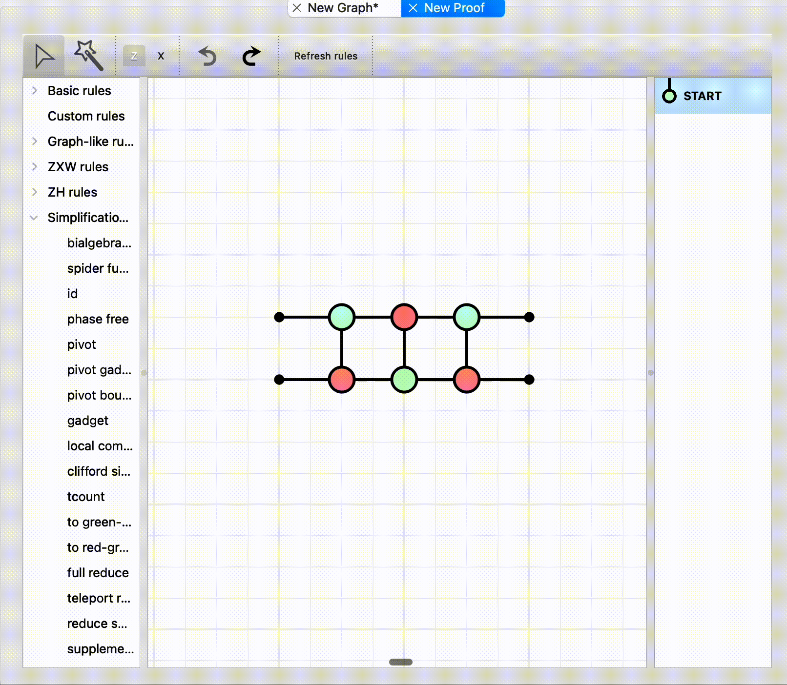
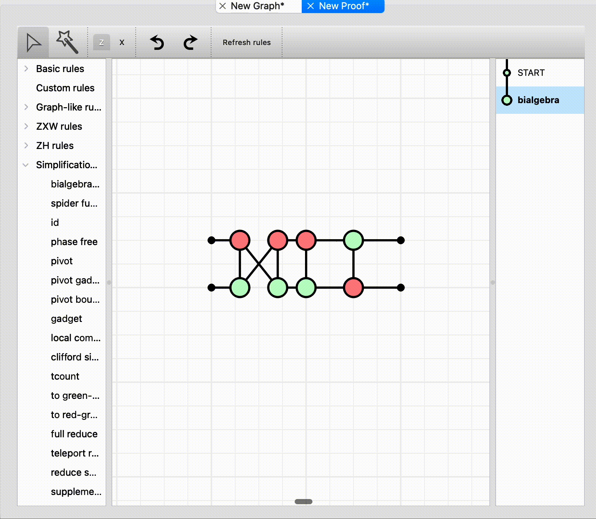
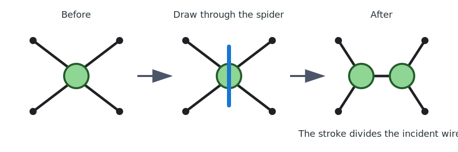
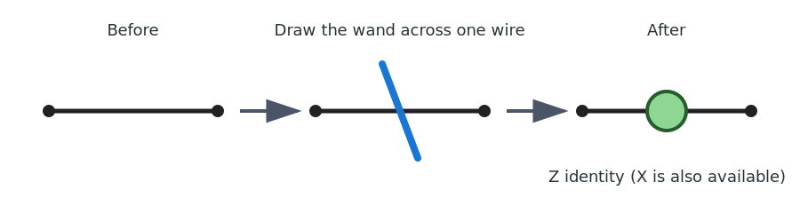
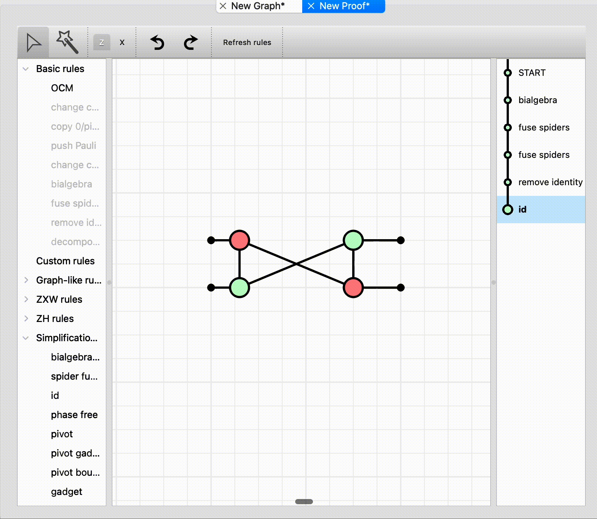

# Proof mode gestures

Proof mode turns every diagram change into a ZX rewrite. You can choose a rule
from the panel on the left, but the most common rewrites are also available as
direct gestures on the diagram.

*The Proof toolbar. Use Select (`s`) for drag-and-drop and double-click
gestures, or the Magic wand (`w`) for stroke gestures. The Z/X toggle chooses
the identity spider added by the wand.*

Every successful gesture adds a step to the rewrite history on the right. If a
gesture does not match a valid rewrite, it leaves the diagram unchanged (or
just moves the dragged spider).

## Quick reference

| Gesture | Result | Important condition |
| --- | --- | --- |
| Drag one spider onto another | Fuse spiders | The connected spiders have the same colour |
| Drag a single-legged 0/π spider onto its neighbour | Copy the 0/π spider | The copy rewrite is valid |
| Drag a π-phase Z/X spider onto its neighbour | Push the Pauli spider | The Pauli rewrite is valid for that pair |
| Drag one spider onto another | Apply strong complementarity (bialgebra) | The pair satisfies the strong-complementarity conditions |
| Double-click a Z or X spider | Change its colour | Hadamard edges are introduced as required |
| Double-click a Hadamard edge or eligible H-box | Toggle between the edge and H-box forms | The selected item represents a valid Hadamard |
| Draw the wand through a spider | Unfuse the spider | The stroke decides how its incident wires are divided |
| Draw the wand through a two-legged, zero-phase spider | Remove the identity spider | Hold Shift to unfuse it instead |
| Draw the wand across one wire | Add an identity spider | The Z/X toolbar toggle chooses its colour |
| Draw the wand across parallel wires | Apply the Hopf rule | The crossed wires form cancellable pairs |

When several drag-and-drop rewrites could match, ZXLive tries them in this
order: **fusion**, **copy 0/π**, **push Pauli**, then **strong
complementarity**.

## Drag-and-drop rewrites

Press `s` to select the **Select** tool, then drag a spider onto another
spider. The target is highlighted when ZXLive recognises a direct rewrite.

### Fusion and strong complementarity

Dragging two connected spiders of the **same colour** together fuses them and
adds their phases. Dragging connected, complementary-colour Z/X spiders with
Pauli phases together can instead apply strong complementarity (also called
bialgebra). ZXLive also supports the corresponding rewrite for a compatible X
spider and standard H-box.

*Dragging complementary spiders together to apply strong complementarity.*

*Fusing same-coloured spiders, then removing the resulting identities.*

### Copy 0/π and push Pauli

Two other rewrites use the same drag-and-drop gesture:

- **Copy 0/π spider through its neighbour** applies to a single-legged spider
  whose phase is 0 or π.
- **Push Pauli** applies to a π-phase Z/X spider and a compatible neighbour.

These names match the entries in the **Basic rules** panel. A 0/π spider may
also satisfy another rewrite, so use the highlighted preview and the rewrite
history to confirm which action will be applied.

## Double-click rewrites

With the Select tool active:

- Double-click a Z or X spider to apply colour change. Its colour flips and
  its incident edge types change as required.
- Double-click a Hadamard edge to expand it into an explicit H-box.
- Double-click an eligible H-box to turn it back into a Hadamard edge.

## Magic wand rewrites

Press `w` (or click the wand button), then hold the left mouse button and draw
a short stroke through the relevant part of the diagram. The wand checks the
stroke in this order: a spider slice, a single wire, then parallel wires.

### Unfuse or remove a spider

Draw through a spider to split it into two same-coloured spiders. The stroke
separates the incident wires into two groups, so its angle and position control
which wires move to each new spider.

By default, drawing through a two-legged, zero-phase spider removes it as an
identity instead of unfusing it. Hold **Shift** to force unfusion and choose
the phase assigned to one side of the split; the remaining phase stays on the
other side.

*The wand stroke divides the incident wires between two connected spiders.*

### Add an identity spider

Draw across exactly one wire without crossing a spider. ZXLive inserts a
two-legged, zero-phase identity spider where the stroke meets the wire. Choose
whether it is a Z or X spider with the toggle beside the wand button.

*Adding a Z identity spider; the toolbar toggle can select an X identity instead.*

### Apply the Hopf rule

Draw across a bundle of parallel wires between compatible spiders. The wand
removes the crossed wires in pairs; if the bundle has an odd number of wires,
one remains.

*Parallel wires can be cancelled in pairs with the Hopf rule.*

## Troubleshooting gestures

- Start a wand stroke on empty canvas. Starting directly on a diagram item can
  select or move it instead.
- For fusion, copy, Pauli push, and strong complementarity, drag only one
  selected spider onto its target.
- If a wand stroke crosses both a spider and wires, the spider action is tried
  first.
- Check the rewrite history after a gesture to see the exact rule that ZXLive
  applied.
